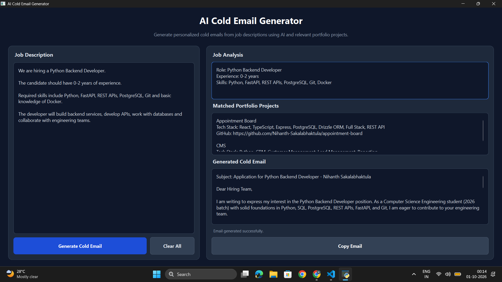

# AI Cold Email Generator

An AI-powered desktop application that analyzes job descriptions, identifies relevant skills, retrieves matching portfolio projects, and generates personalized professional cold emails for job applications.

## Application Preview



## Features

- Paste any job description into the desktop application
- Extracts job role, experience, and required skills using an LLM
- Matches relevant portfolio projects using ChromaDB semantic search
- Generates personalized professional cold emails
- Uses candidate information and verified project data to reduce hallucinations
- Displays matched projects with their tech stacks and GitHub links
- Copies generated emails directly to the clipboard
- Clear All option to reset the application
- Clean desktop interface built with PySide6

## Tech Stack

- Python
- PySide6
- LangChain
- Groq API
- ChromaDB
- Pandas
- python-dotenv

## How It Works

1. The user pastes a job description into the application.
2. The LLM extracts the job role, required experience, skills, and description.
3. ChromaDB performs semantic retrieval to identify relevant portfolio projects.
4. Retrieved project information and the candidate profile are provided as context to the LLM.
5. Prompt constraints help keep generated content grounded in verified candidate and project information.
6. The application generates a concise and personalized cold email.
7. The generated email can be copied directly from the GUI.

## Project Structure

```text
Cold-Email-Generator/
│
├── screenshots/
│   └── app-demo.png
│
├── candidate_profile.py
├── email_generator.py
├── gui.py
├── job_parser.py
├── main.py
├── portfolio.py
├── portfolio.csv
├── requirements.txt
├── .gitignore
└── README.md
```

## Installation

Clone the repository:

```bash
git clone https://github.com/Nihanth-Sakalabhaktula/Cold-Email-Generator.git
```

Navigate to the project directory:

```bash
cd Cold-Email-Generator
```

Create a virtual environment:

```bash
python -m venv venv
```

Activate the virtual environment on Windows:

```bash
venv\Scripts\activate
```

Install the required dependencies:

```bash
pip install -r requirements.txt
```

## Environment Variables

Create a `.env` file in the project root directory:

```env
GROQ_API_KEY=your_groq_api_key_here
```

> Never commit your `.env` file or API key to GitHub.

## Run the Application

Start the desktop application with:

```bash
python gui.py
```

## Example Workflow

1. Paste a job description into the **Job Description** section.
2. Click **Generate Cold Email**.
3. Review the extracted **Job Analysis**.
4. Review the **Matched Portfolio Projects**.
5. Review the **Generated Cold Email**.
6. Click **Copy Email** to copy the generated email.

## Key Concepts Demonstrated

This project demonstrates practical implementation of:

- Large Language Models (LLMs)
- Prompt Engineering
- Retrieval-Augmented Generation (RAG)
- Semantic Search
- ChromaDB Vector Retrieval
- Job Description Parsing
- Grounded AI Generation
- LangChain Integration
- Desktop GUI Development
- Environment Variable Management

## Security

Sensitive information such as the Groq API key is stored in a local `.env` file.

The following files and directories are excluded from Git using `.gitignore`:

```text
.env
venv/
venv312/
__pycache__/
chroma_db/
.vscode/
.idea/
```

## Author

**Nihanth Sakalabhaktula**

GitHub: https://github.com/Nihanth-Sakalabhaktula

## Repository

https://github.com/Nihanth-Sakalabhaktula/Cold-Email-Generator